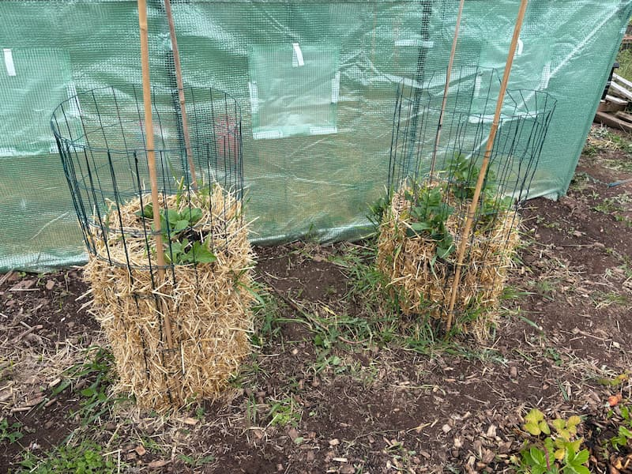
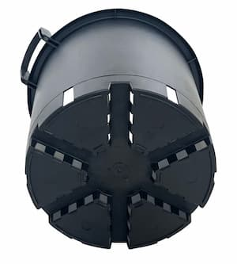
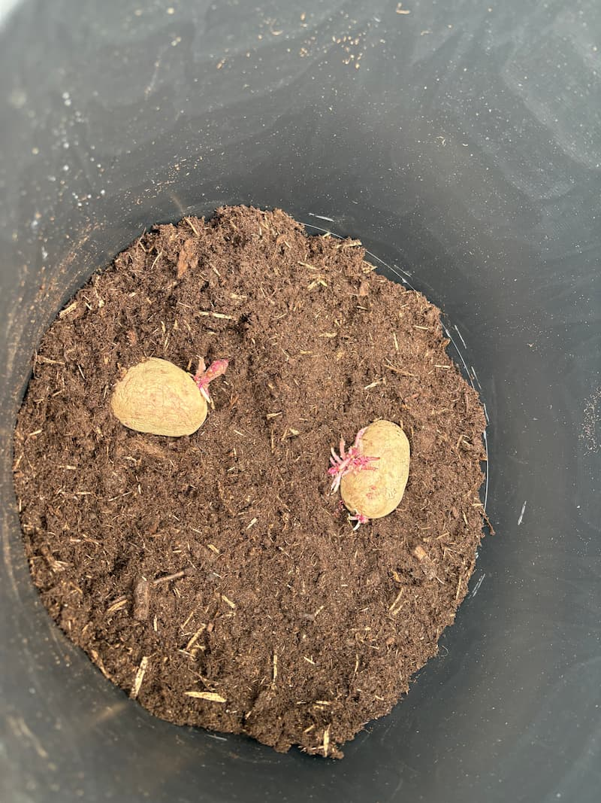
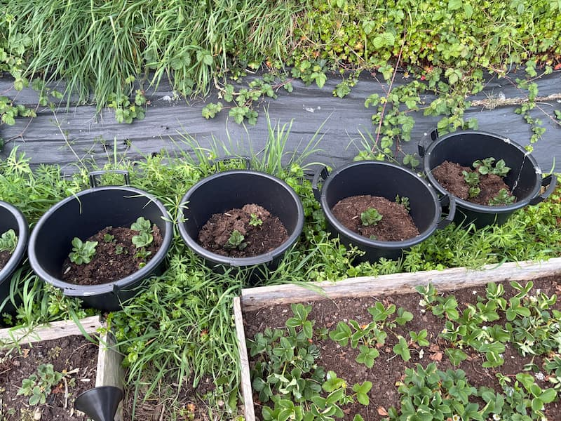
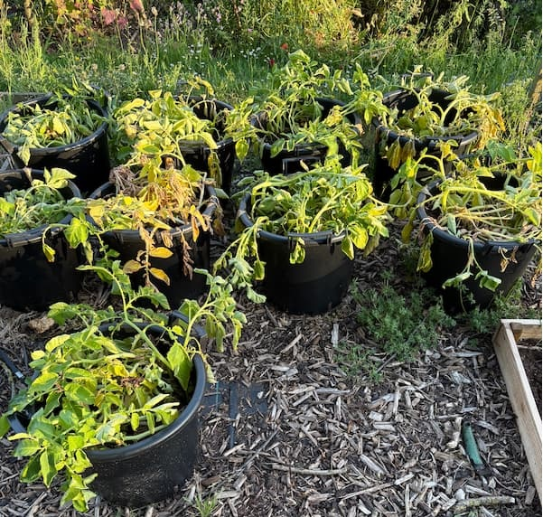
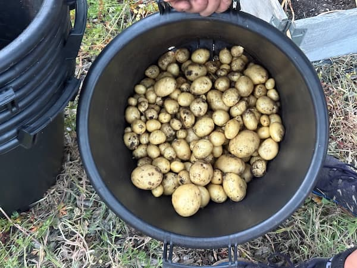

---

title: 'Growing potatoes'

description: 'Growing potatoes on my allotment... in buckets!'

pubDate: 'May 30 2026'

heroImage: '../../assets/blog-images/30-05-2026/growing-potatoes.jpg'

tags:

  - potatoes

  - first-earlies

  - second-earlies

  - main crop

  - buckets

  - overcrowding

---

## Last years potatoes

So I thought I would start this post off with how we grew potatoes on my partner's allotment last year and why I am never doing it again! After getting the inspiration from social media, we had decided to grow potatoes in ‘potato towers’, they looked super cool and in this video we saw the guy harvest a load of potatoes so we thought we would give it a try (especially as it seemed so inexpensive). 

So the potato tower consisted of some mesh fencing wrapped round in a cylinder and supported by a few canes we tapped into the ground for support, then we filled up the towers with compost down the center and straw around the sides and the bottom; as we filled up the tower we put the potatoes in at intervals and tried to angle them so they would grow out of the sides. We used some mesh fencing that a coworker was getting rid of (yay recycling!!), and the straw was just from pets at home. 

Now I have no idea what really went wrong with these, maybe they just got too dry or something, but I think we actually got out fewer potatoes than we put in! 

 

## This year's plan 

Now, at this point, after the disappointing crop of last year, you would think that I’d stop listening to people on social media but I’m glad I didn’t. After watching an amazing video on YouTube from [Simplify Gardening](https://youtube.com/@simplifygardening?si=VSvgl_ztWXmMfWb3) I had decided to start planting potatoes in containers instead of in the ground or in ‘potato towers’. And I sure went all in! 

I ended up buying thirty 30L oaklands growing containers, one set each for firsts, seconds and main crop potatoes, about 18 bags of compost and some seed potatoes to plant. Now don’t make the same mistake I did and not label your plants because truthfully, I cannot remember what varieties of potatoes I have planted. 

 

The technique I have followed was to fill up the container about a third of the way full with compost and ensuring that the compost didn’t have any clumps in it, then adding 1-2 seed potatoes on the top (don't make the same mistake I did with my first earlies and use more than two per container as you may end up with lots of teeny tiny potatoes). After a chat with a more seasoned allotment holder, I took the advice to <ins>heavily</ins> water them and then fill the bucket up about another third with compost and heavily water them again. 

 

Within about two weeks I saw my first sprouts of potatoes, I made sure to water them every three days (as long as it didn't rain) and nearing the end of their life I sprinkled some chicken manure pellets on top of them. For my seconds/main crop potatoes, I will be using a more general fertiliser on them at first, then will again put some of those pellets on top to give them one final boost. 

 

Here is what my potatoes were starting to look like about 1 week before harvesting:

 

When harvesting out of these buckets, it was super easy compared to digging them up out of the ground; all we had to do was tip them out into a wheelbarrow and fish about for all of the potatoes. The great thing is that I have reused all of the compost from my buckets in my other beds and put the leaves of the potatoes into my compost. Most importantly, I got about half a bucket of lovely salad potatoes for me to take home and eat - I am looking forward to seeing the results of my other types of potatoes, which weren't subject to overcrowding. 

## Takeaways:
- Don't overcrowd the buckets; you'll end up with tiny potatoes.
- Keep them watered
- And finally, find people to share your harvest with, as you will end up with too many!

 