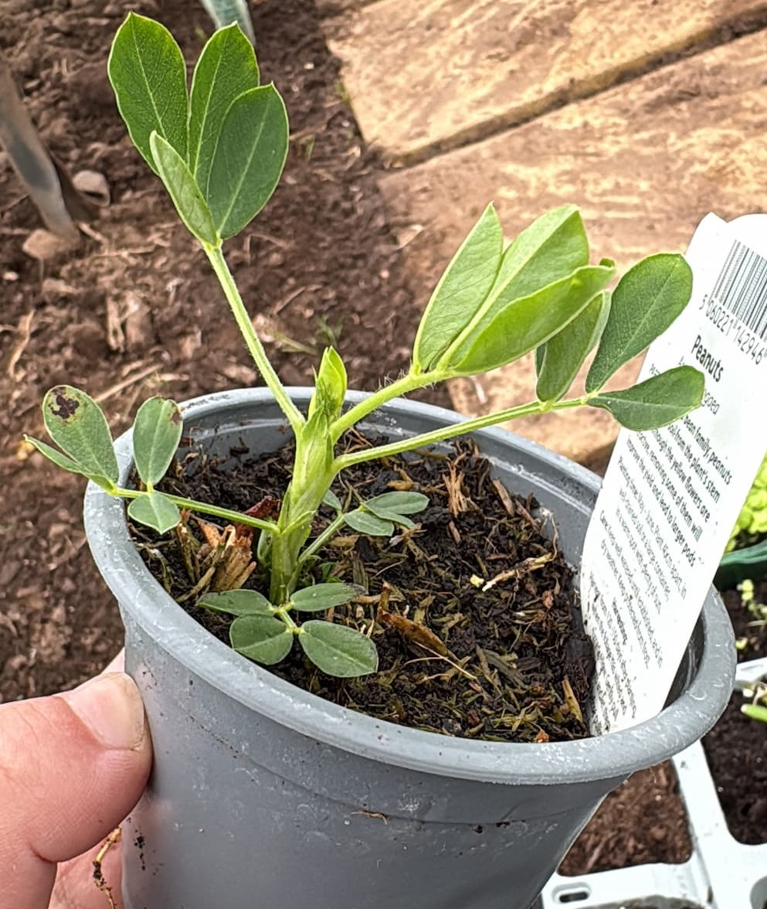
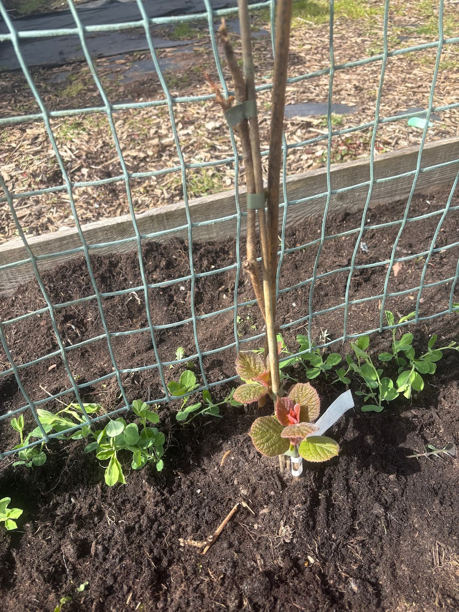

Before having my allotment I was worried that I would't be able to grow stuff that I liked to eat, for one I didnt even think I was allowed to plant fruit trees on my allotment as some associations either don't allow them or have restrictions on them. I also thought I wouldn't be able to grow slightly more exotic things, as I am based in the UK however I have been preoven wrong! This post will just be about a few things I thought I couldnt grow in the UK, which of those things I have going at the moment and what I want to grow. 

## Fruit trees

Now when I think of fruit trees I always think of those massive apple trees that you see taking over back gardens or the absolutely huge apple tree (which I think must be like ten metres tall) that is growing on our allotment site. Obviously there was no chance of me having one of those on my allotment but I have found some great alternatives. After doing some reading I found out that you can get fruit trees with different rootstocks, for apple trees in particular you can get lots of different types of apples at a very dwarfing rootstock called M27. These apple trees grow to about 1.8-2m tall which means theyre perfect for growing on allotments. 

> 🌿 **Info:** Rootstock is the bottom part of a plant that has been grafted that allows you to control different factors such as vigor, disease resistance and soil adaptability.

I have now got many varieties of apples on this very dwarfing rootstock such as:
- Granny smith
- Discovery
- Cox's Orange Pippin
- Jonagold
- Tickled Pink (Frank P Matthews)
- Surprize (Frank P Matthews)

Then for my pear trees (williams and conference varieties) I have them on a Quince C rootstock which is slightly bigger than my apple trees growing up to 2.5-3m tall. And so far they all seem to have been a success! All of them except the few trees I got from garden centers have been purchased from tesco as bareroot trees for only £6 each. 

One tree I have, that I was particularly surprised at being able to grow in the UK is my peach tree which I had originally thought could only be grown in warmer climates. Unfortunately the peach tree I have is currently residing in a big pot on my allotment rather than in the ground as it wasn't looking too healthy when I got it. I truly don't expect to get much if anything from my little fruit trees this year, especially the peach trees, but I see it as a long term investment. I can't stop thinking about how great it will be to try my first fresh peach when they do grow!

## Other surprising plants I currently have growing

Along with my fruit trees, I have branched out with other plants that I'm growing such as peanuts. I bought two peanut plants from a garden center (I will try growing from seed if they turn out well) and for the past couple of weeks I have kept them in my greenhouse at my allotment. Thankfully the weather has been lovely and warm so they seem to be thriving - I have had about an inch of growth since purchasing them. At some point in late May I will plant them into the ground, somewhere with deep soil, in my coldframe. 

As well as peanuts I also thought that kiwis would need a warmer climate so again when I saw one in a pot outside at the garden center I was very surprised and obviously had to purchase it immediately! The kiwi plant that I have is still very young so again, like the trees, this is a more long term investment as I probably won't see any kiwis for 4 years!

## More plants that I want to grow 

Finally, I have plans to grow sweet potatoes and melons in my allotment, both of which I didn't know until recently you can grow in the UK. In future blog posts I hope to keep writing about my experiences of growing these and hopefully eating/cooking them!
